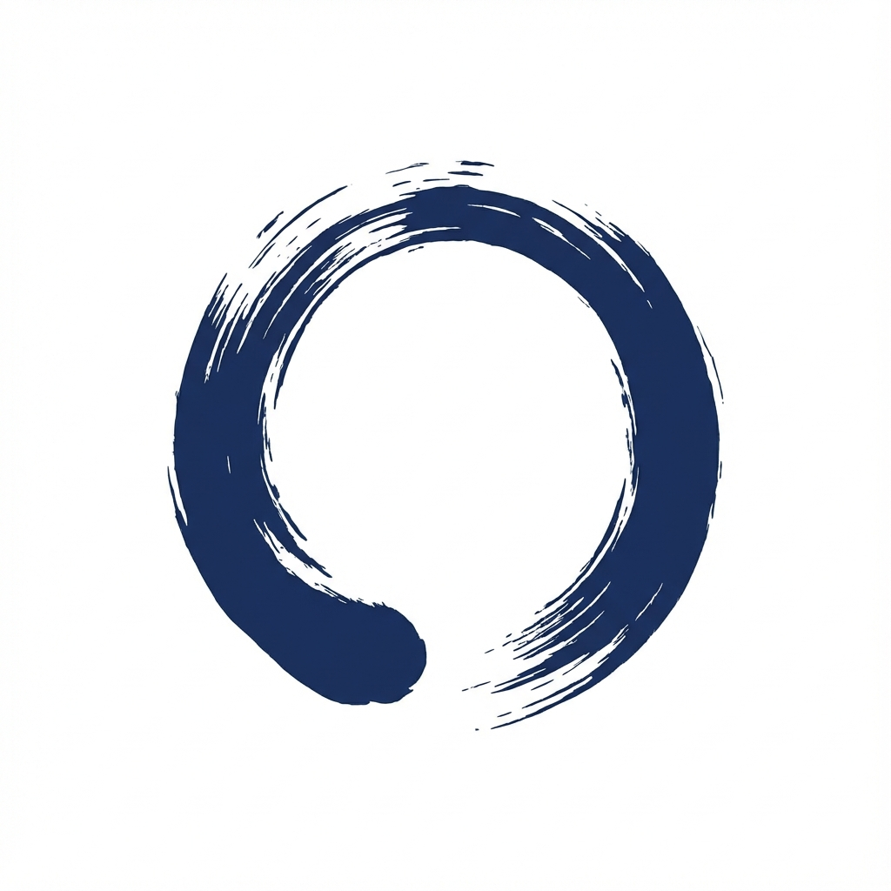

# 不断捨離 (Indecision Declutter)

> **「捨てられない」を「一時退避」して、断捨離を止めない PWA**
> _"Don't stop decluttering. Evacuate your hesitation."_

<p align="center">
  
</p>

## 概要 (Overview)

断捨離中に「これ、どうしようかな…」と迷った瞬間、手は止まり、掃除は終わってしまいます。
**不断捨離**は、その「迷い」を写真に撮ることでデジタル空間へ**一時退避**させ、物理的な片付けをノンストップで進めるためのツールです。

「捨てる」か「残す」かではなく、「とりあえずデジタル化して保留」という第3の選択肢を提供します。

👉 **[開発思想・デザイン哲学はこちら (docs/PHILOSOPHY.md)](docs/PHILOSOPHY.md)**

## 特徴 (Features)

- **📸 迷ったら撮る (Capture Flow)**
    - カメラを起動し、写真を撮って「捨てたい度」を選ぶだけ。
    - 思考停止せずに次々と記録できる「連続撮影ループ」UI。
    - 画像は端末内で自動圧縮され、容量を圧迫しません。
- **🧹 2列グリッド整理 (Workbench)**
    - 撮影したモノは写真メインのグリッドで一覧表示。
    - 「🔥今すぐ」「👋捨てたい」などの直感的なフィルタリング。
    - 「#高かった」「#思い出」などの理由タグで分類可能。
- **👋 安心の手放し (Let Go)**
    - 詳細画面では、購入価格や最後の使用日、モノへの想いを記録可能。
    - 決心がついたら「手放す」ボタンへ。データは「捨離リスト」にアーカイブされ、記憶として残り続けます（**記憶の連続性**）。
- **🍵 和モダン・禅デザイン**
    - 墨と和紙をイメージした落ち着いた配色。
    - 焦りを生まない、静かなUI体験。
- **📱 PWA / Local First**
    - インストール不要、オフライン動作。
    - データは全て端末内（IndexedDB）に保存され、プライバシーも安心。

## 技術スタック (Tech Stack)

- **Framework:** Vue 3 + Vite
- **Language:** TypeScript
- **State/Logic:** Composition API
- **Database:** Dexie.js (IndexedDB wrapper)
- **Styling:** Vanilla CSS (CSS Variables for theming)
- **Icons:** Lucide Vue Next
- **PWA:** Vite PWA Plugin

## 開発環境 (Development)

```bash
# Install dependencies
npm install

# Run dev server
npm run dev

# Build for production
npm run build
```

## ディレクトリ構成

- `src/pages/` - 各画面 (Capture, Workbench, Details)
- `src/lib/` - DB定義 (Dexie), ロジック (useItems)
- `src/components/` - 再利用コンポーネント
- `docs/` - ドキュメント・思想メモ

## License

MIT
